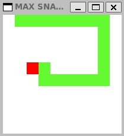

# Snake

A simple Snake game written in C++ using SFML for graphics, rendering, and keyboard input

# Features

Snake movement and collision detection

Keyboard controls (wasd)

Built with SFML and CMake

High score tracking

# Requirements

C++17 compatible compiler

CMake

SFML 2.x

